# 🏗️ Arquitetura Detalhada - FIAP CI/CD Demo

## 📋 Visão Geral do Sistema

### **🎯 Objetivo**
Demonstrar um pipeline completo de CI/CD usando GitHub Actions para deploy automatizado de uma aplicação React no AWS S3.

---

## 🔄 Fluxos de Deploy

### **📊 Comparação: Manual vs Automatizado**
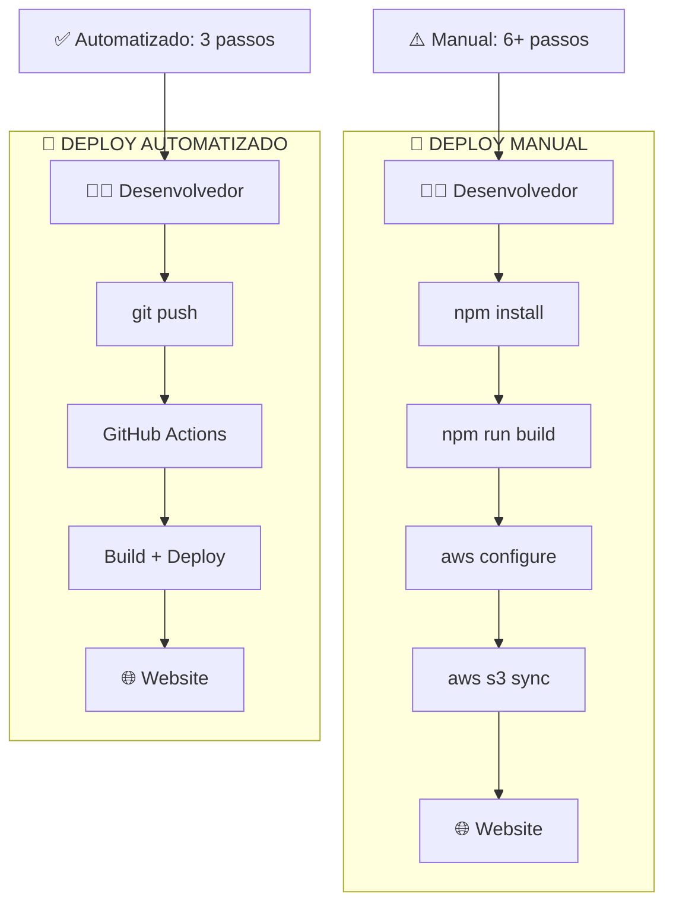

---

## 🤖 GitHub Actions Workflow Detalhado

### **⚙️ Pipeline Completo**
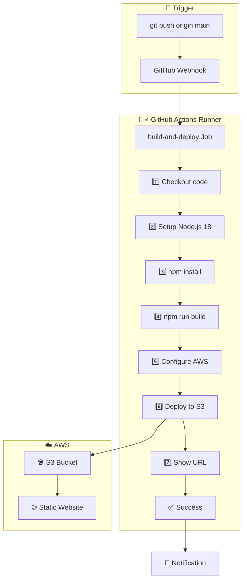

### **📝 Workflow YAML Breakdown**
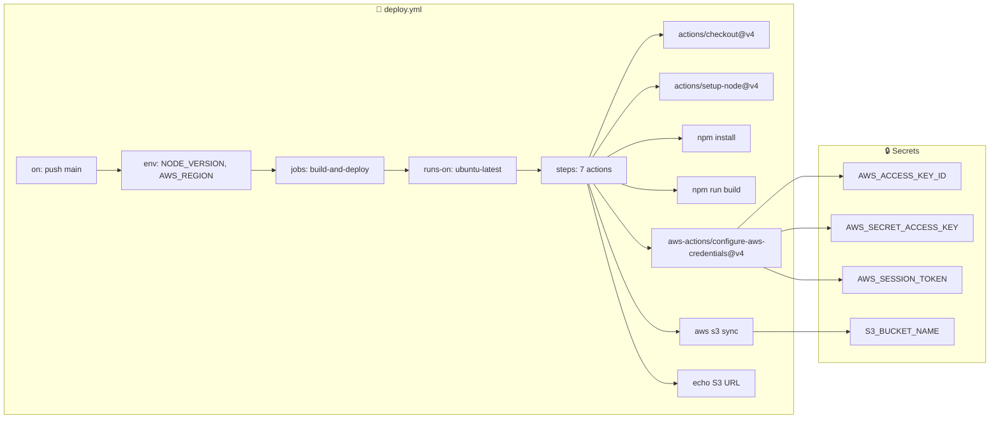

---

## 🏛️ Infraestrutura AWS

### **🪣 S3 Static Website Hosting**
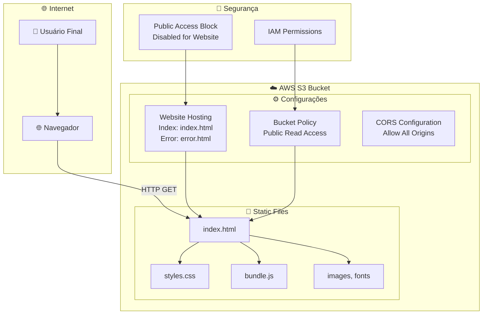

### **🔑 Credenciais e Acesso**
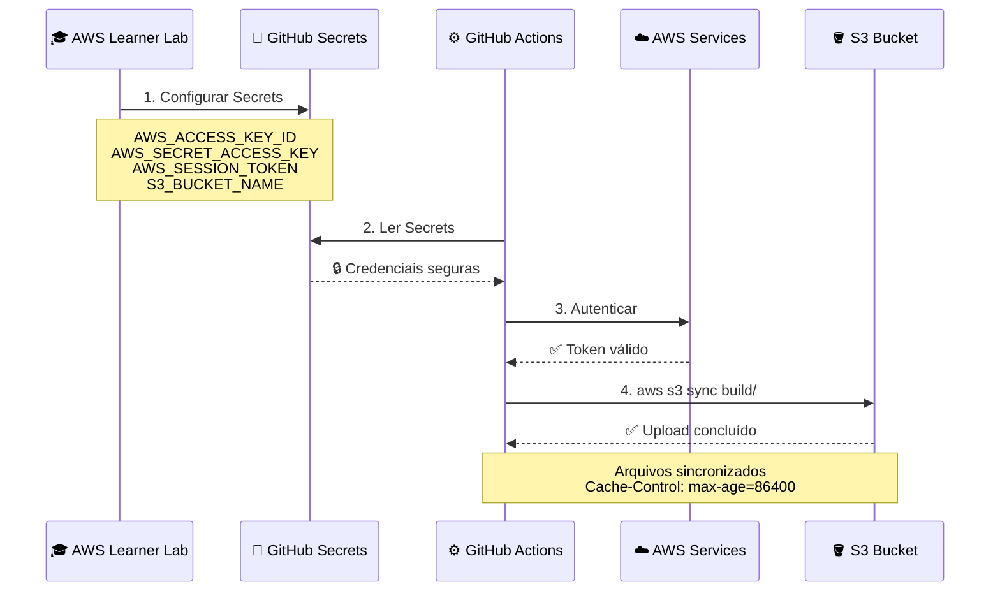

---

## 📊 Métricas e Monitoramento

### **⏱️ Performance do Pipeline**
```mermaid
gantt
    title 🚀 Timeline do Deploy (GitHub Actions)
    dateFormat X
    axisFormat %s

    section Setup
    Checkout code           :0, 10
    Setup Node.js          :10, 20
    
    section Build
    npm install            :20, 60
    npm run build          :60, 90
    
    section Deploy
    Configure AWS          :90, 100
    Deploy to S3           :100, 130
    Show URL               :130, 140
    
    section Total
    Pipeline completo      :0, 140
```

### **📈 Comparação de Eficiência**
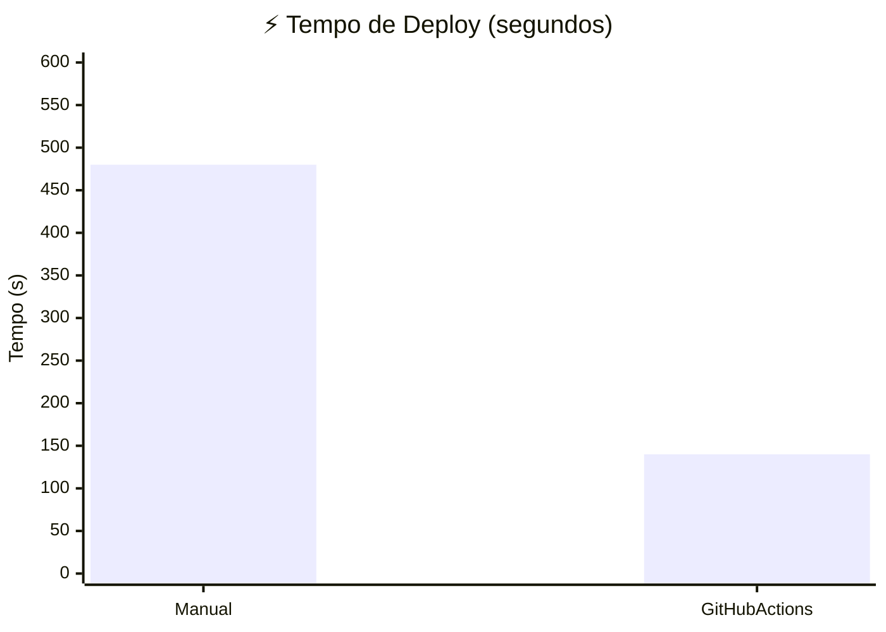

---

## 🔧 Componentes Técnicos

### **📦 Dependências do Projeto**
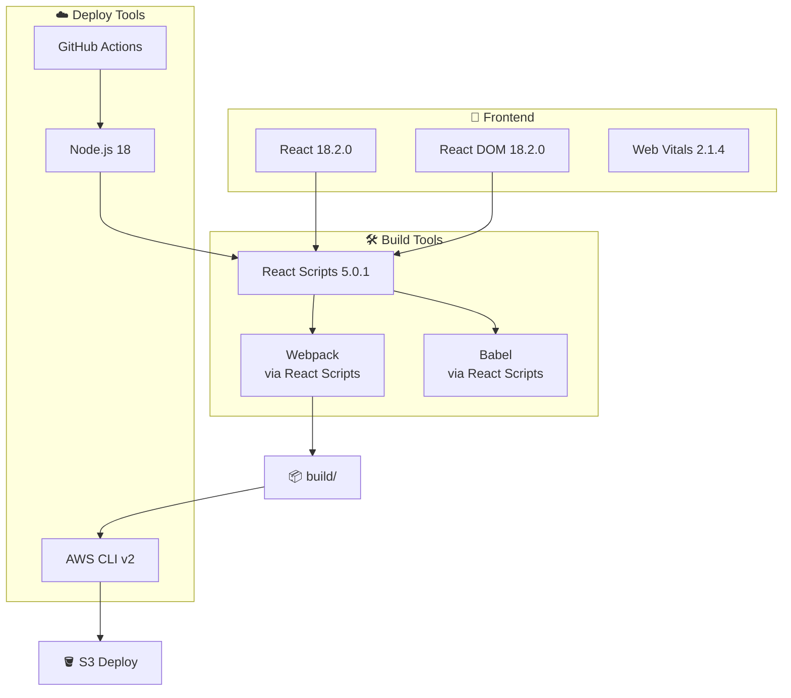

### **🌐 Arquitetura de Rede**
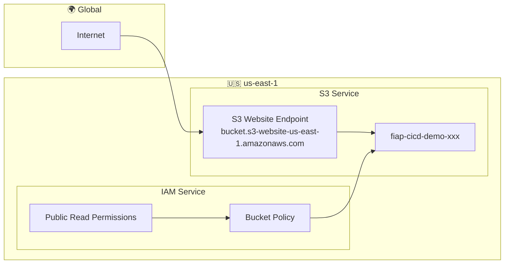

---

## 🎓 Valor Educacional

### **📚 Conceitos DevOps Demonstrados**
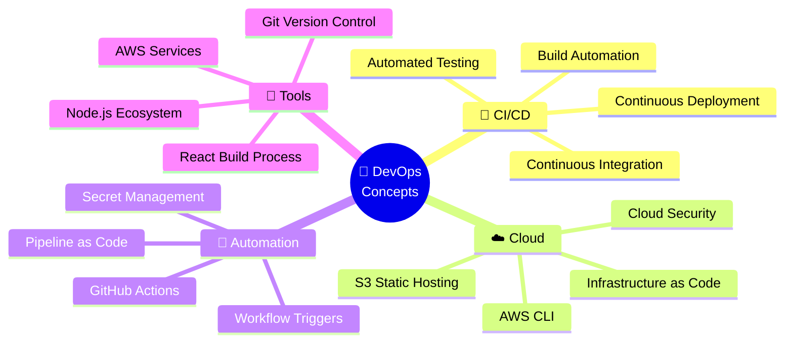

### **🎯 Jornada de Aprendizado**
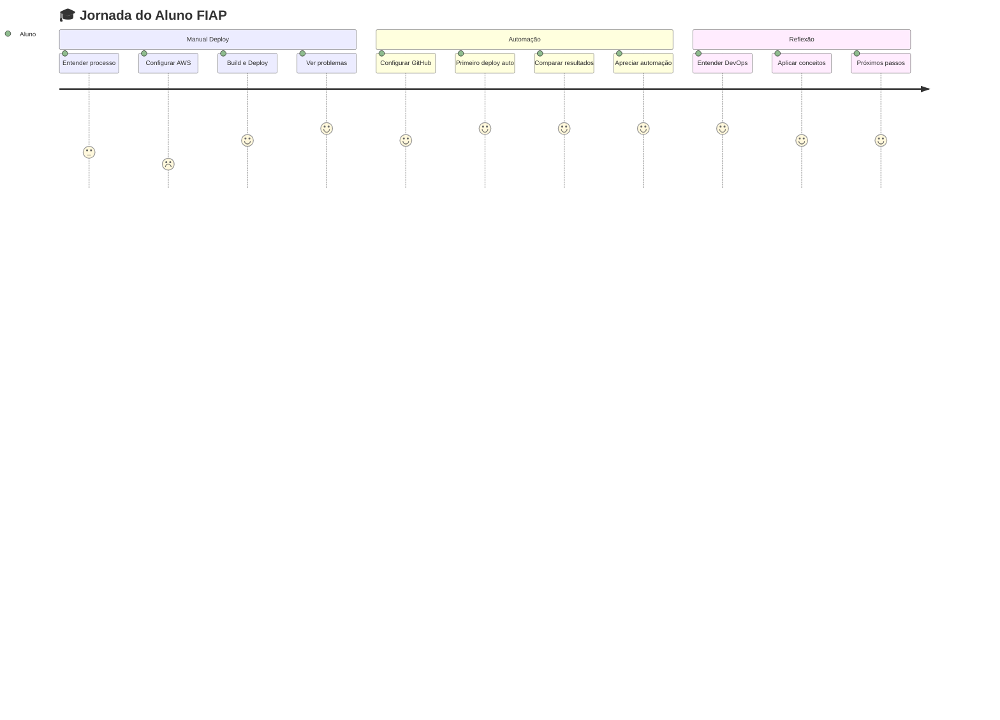

---

**🎉 Esta arquitetura demonstra na prática os princípios fundamentais de DevOps: automação, colaboração e entrega contínua! 🚀**
