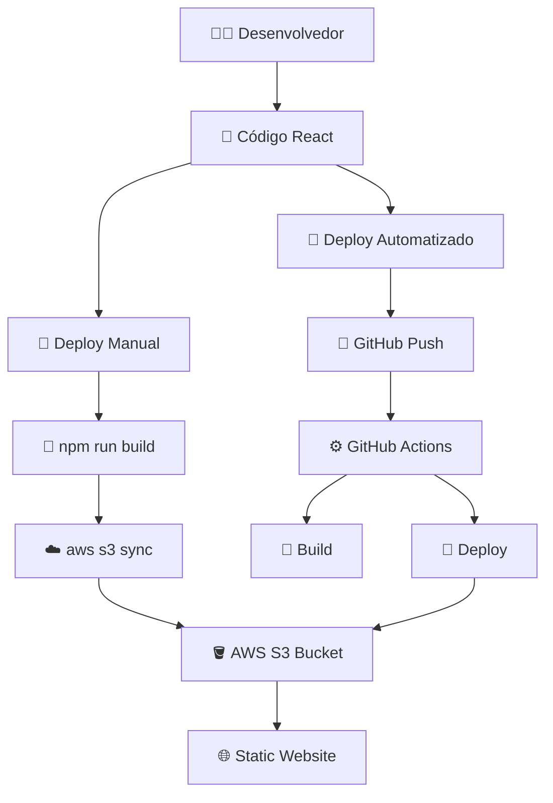
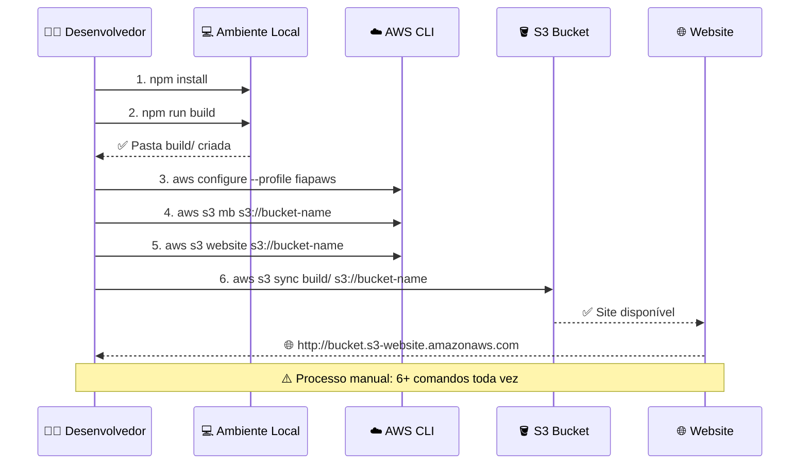
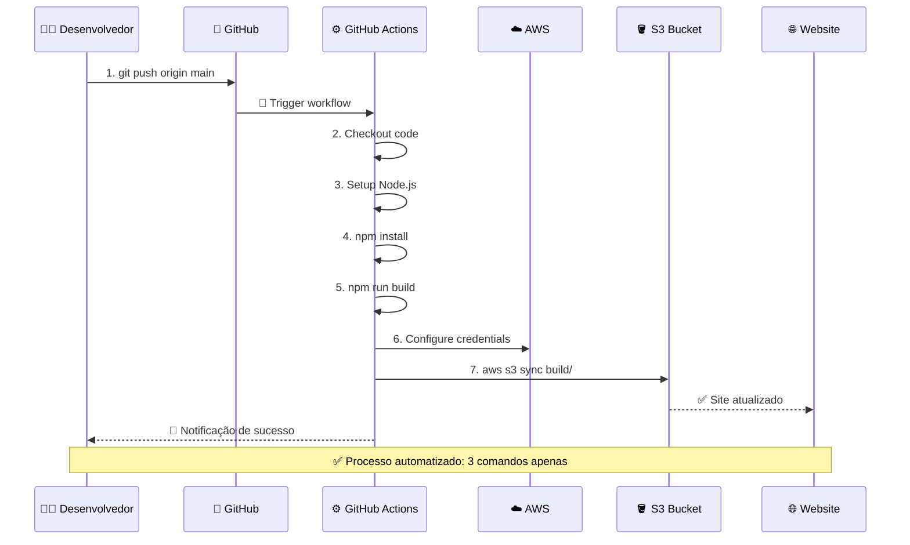
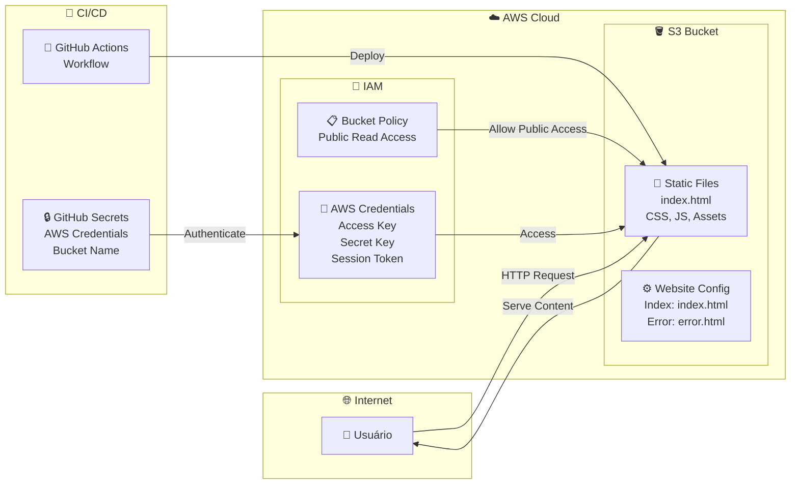

# 🚀 FIAP CI/CD Demo - DevOps e Arquitetura Cloud

## 📋 Visão Geral

Este projeto demonstra a implementação de um pipeline completo de CI/CD utilizando **GitHub Actions** para deploy automatizado de uma aplicação React no **AWS S3** com hosting estático.

### 🎯 Objetivos da Aula

- Implementar pipeline de CI/CD com GitHub Actions
- Deploy automatizado no AWS S3
- Boas práticas de DevOps e automação

---

## 🛠️ Stack Tecnológico

- **Frontend**: React 18
- **CI/CD**: GitHub Actions
- **Cloud**: AWS (S3, IAM)
- **Hosting**: S3 Static Website

## 🏗️ Arquitetura do Sistema

### **📋 Visão Geral**


### **🔄 Fluxo Manual (Parte 1 da Live)**


### **🤖 Fluxo Automatizado (Parte 2 da Live)**


### **🏛️ Infraestrutura AWS**


---

## 📚 Pré-requisitos

### 🔧 Ferramentas Necessárias

- **Node.js** 18+ ([Download](https://nodejs.org/))
- **Git** ([Download](https://git-scm.com/))
- **AWS CLI** ([Instalação](https://docs.aws.amazon.com/cli/latest/userguide/getting-started-install.html))
- **Conta GitHub** ([Criar conta](https://github.com/))

### ☁️ Ambiente AWS

- Acesso ao **AWS Learner Lab** da FIAP
- Credenciais AWS configuradas
- Permissões para S3 e IAM

---

## 🎯 **Guias de Aprendizado**

### **📚 Jornada Completa de Aprendizado:**
1. **🔧 `STEP-BY-STEP-LOCAL.md`** - **COMECE AQUI!** Deploy manual completo
2. **🤖 `STEP-BY-STEP-GITHUB-ACTIONS.md`** - Automatize tudo com CI/CD
3. **⚙️ `SETUP-ENVIRONMENT.md`** - Configuração do ambiente
4. **🏗️ `ARQUITETURA.md`** - Diagramas e arquitetura detalhada

> 📋 **Ver `INDICE.md` para navegação completa de todos os arquivos**

### **🎯 Metodologia:**
**Manual Primeiro → Depois Automatizado**
- ✅ Entender cada passo do processo
- ✅ Ver os problemas do deploy manual  
- ✅ Apreciar o valor da automação
- ✅ DevOps na prática real!

---

## 🚀 Guia Passo-a-Passo (Resumido)

### **Etapa 1: Configuração do Ambiente Local**

#### 1.1 Clone do Repositório
```bash
git clone https://github.com/SEU_USUARIO/fiap-demo-cicd-static-website-aws.git
cd fiap-demo-cicd-static-website-aws
```

#### 1.2 Instalação das Dependências
```bash
npm install
```

#### 1.3 Teste Local
```bash
# Executar em modo desenvolvimento
npm start

# Executar testes
npm test

# Build de produção
npm run build
```

### **Etapa 2: Configuração do AWS CLI**

#### 2.1 Configurar Profile AWS
```bash
# Configurar profile fiapaws
aws configure --profile fiapaws

# Inserir as credenciais do Learner Lab:
# AWS Access Key ID: [SUA_ACCESS_KEY]
# AWS Secret Access Key: [SUA_SECRET_KEY]
# Default region name: us-east-1
# Default output format: json
```

#### 2.2 Testar Conexão
```bash
# Testar conexão com AWS
aws sts get-caller-identity --profile fiapaws

# Listar buckets S3
aws s3 ls --profile fiapaws
```

### **Etapa 3: Criação da Infraestrutura AWS**

#### 3.1 Criar Bucket S3
```bash
# Criar bucket (nome deve ser único globalmente)
export BUCKET_NAME="fiap-cicd-demo-$(date +%s)"
aws s3 mb s3://$BUCKET_NAME --profile fiapaws --region us-east-1

# Configurar bucket para hosting estático
aws s3 website s3://$BUCKET_NAME \
  --index-document index.html \
  --error-document error.html \
  --profile fiapaws
```

#### 3.2 Configurar Política do Bucket
```bash
# Criar arquivo de política
cat > bucket-policy.json << EOF
{
  "Version": "2012-10-17",
  "Statement": [
    {
      "Sid": "PublicReadGetObject",
      "Effect": "Allow",
      "Principal": "*",
      "Action": "s3:GetObject",
      "Resource": "arn:aws:s3:::$BUCKET_NAME/*"
    }
  ]
}
EOF

# Aplicar política
aws s3api put-bucket-policy \
  --bucket $BUCKET_NAME \
  --policy file://bucket-policy.json \
  --profile fiapaws
```

#### 3.3 Desabilitar Block Public Access
```bash
aws s3api put-public-access-block \
  --bucket $BUCKET_NAME \
  --public-access-block-configuration \
  "BlockPublicAcls=false,IgnorePublicAcls=false,BlockPublicPolicy=false,RestrictPublicBuckets=false" \
  --profile fiapaws
```

### **Etapa 4: Configuração do GitHub Actions**

#### 4.1 Fork do Repositório
1. Acesse o repositório no GitHub
2. Clique em **Fork**
3. Clone seu fork localmente

#### 4.2 Configurar Secrets no GitHub
Acesse: `Settings > Secrets and variables > Actions`

**Repository Secrets:**
- `AWS_ACCESS_KEY_ID`: Sua Access Key do Learner Lab
- `AWS_SECRET_ACCESS_KEY`: Sua Secret Key do Learner Lab
- `AWS_SESSION_TOKEN`: Seu Session Token do Learner Lab
- `S3_BUCKET_NAME`: Nome do bucket criado

#### 4.3 Estrutura do Pipeline

O pipeline possui 1 job simplificado:

**build-and-deploy**: Instala dependências → Build → Deploy no S3

### **Etapa 5: Deploy e Teste**

#### 5.1 Primeiro Deploy
```bash
# Fazer alteração no código
echo "// Primeira alteração" >> src/App.js

# Commit e push
git add .
git commit -m "feat: primeiro deploy automatizado"
git push origin main
```

#### 5.2 Acompanhar Pipeline
1. Acesse a aba **Actions** no GitHub
2. Observe a execução do workflow
3. Verifique os logs de cada etapa

#### 5.3 Verificar Deploy
```bash
# URL do site estático
echo "Site disponível em: http://$BUCKET_NAME.s3-website-us-east-1.amazonaws.com"
```

---

## 🔍 Monitoramento e Troubleshooting

### 📊 Verificações Importantes

#### Verificar Status do Bucket
```bash
# Listar objetos no bucket
aws s3 ls s3://$BUCKET_NAME --profile fiapaws --recursive

# Verificar configuração de website
aws s3api get-bucket-website --bucket $BUCKET_NAME --profile fiapaws
```

#### Logs do GitHub Actions
- Acesse **Actions** > **Workflow run**
- Clique em cada job para ver logs detalhados
- Verifique erros de permissão ou configuração

#### Troubleshooting Comum

**Erro de Permissão AWS:**
```bash
# Verificar credenciais
aws sts get-caller-identity --profile fiapaws

# Verificar permissões do bucket
aws s3api get-bucket-policy --bucket $BUCKET_NAME --profile fiapaws
```

**Erro de Build:**
```bash
# Testar build local
npm run build

# Verificar dependências
npm audit
```

---

## 🎨 Customizações Avançadas

### 🌐 CloudFront (Opcional)

#### Criar Distribuição CloudFront
```bash
# Criar arquivo de configuração
cat > cloudfront-config.json << EOF
{
  "CallerReference": "fiap-demo-$(date +%s)",
  "Comment": "FIAP CI/CD Demo Distribution",
  "DefaultRootObject": "index.html",
  "Origins": {
    "Quantity": 1,
    "Items": [
      {
        "Id": "S3-$BUCKET_NAME",
        "DomainName": "$BUCKET_NAME.s3.amazonaws.com",
        "S3OriginConfig": {
          "OriginAccessIdentity": ""
        }
      }
    ]
  },
  "DefaultCacheBehavior": {
    "TargetOriginId": "S3-$BUCKET_NAME",
    "ViewerProtocolPolicy": "redirect-to-https",
    "TrustedSigners": {
      "Enabled": false,
      "Quantity": 0
    },
    "ForwardedValues": {
      "QueryString": false,
      "Cookies": {
        "Forward": "none"
      }
    }
  },
  "Enabled": true
}
EOF

# Criar distribuição
aws cloudfront create-distribution \
  --distribution-config file://cloudfront-config.json \
  --profile fiapaws
```

### 🔒 Melhorias de Segurança

#### Origin Access Control (OAC)
```bash
# Criar OAC
aws cloudfront create-origin-access-control \
  --origin-access-control-config \
  Name="fiap-demo-oac",Description="OAC for FIAP demo",OriginAccessControlOriginType="s3",SigningBehavior="always",SigningProtocol="sigv4" \
  --profile fiapaws
```

---

## 📈 Métricas e Monitoramento

### 📊 CloudWatch Metrics
- Requests por minuto
- Bytes transferidos
- Erros 4xx/5xx
- Cache hit ratio (CloudFront)

### 🔍 Logs de Acesso
```bash
# Habilitar logs de acesso S3
aws s3api put-bucket-logging \
  --bucket $BUCKET_NAME \
  --bucket-logging-status file://logging-config.json \
  --profile fiapaws
```

---

## 🎓 Exercícios Práticos

### 🏃‍♂️ Exercício 1: Modificação de Conteúdo
1. Altere o texto principal da aplicação
2. Faça commit e push
3. Observe o pipeline executar
4. Verifique a atualização no site

### 🏃‍♂️ Exercício 2: Adição de Testes
1. Adicione novos testes em `src/App.test.js`
2. Execute localmente: `npm test`
3. Faça commit e observe o pipeline

### 🏃‍♂️ Exercício 3: Configuração de Ambiente
1. Adicione variáveis de ambiente no GitHub
2. Use as variáveis na aplicação React
3. Teste o deploy com as novas configurações

---

## 📚 Recursos Adicionais

### 🔗 Links Úteis
- [GitHub Actions Documentation](https://docs.github.com/en/actions)
- [AWS S3 Static Website Hosting](https://docs.aws.amazon.com/AmazonS3/latest/userguide/WebsiteHosting.html)
- [AWS CloudFront Documentation](https://docs.aws.amazon.com/cloudfront/)
- [React Documentation](https://reactjs.org/docs/getting-started.html)

### 📖 Próximos Passos
- Implementar testes E2E com Cypress
- Configurar múltiplos ambientes (dev/staging/prod)
- Implementar rollback automático
- Adicionar notificações Slack/Teams
- Configurar monitoramento com CloudWatch

---

## 🤝 Contribuição

Este projeto foi desenvolvido para fins educacionais no curso **DevOps e Arquitetura Cloud** da **FIAP POS Tech**.

### 👨‍🏫 Professor
**José Neto**
- Email: [professor@fiap.com.br]
- LinkedIn: [linkedin.com/in/professor]

### 🏫 Instituição
**FIAP - Faculdade de Informática e Administração Paulista**
- Site: [fiap.com.br](https://fiap.com.br)
- Curso: [DevOps e Arquitetura Cloud](https://postech.fiap.com.br/curso/devops-e-arquitetura-cloud)

---

## 📄 Licença

Este projeto é licenciado sob a MIT License - veja o arquivo [LICENSE](LICENSE) para detalhes.

---

**© 2024 FIAP - Desenvolvido para fins educacionais** 🎓
